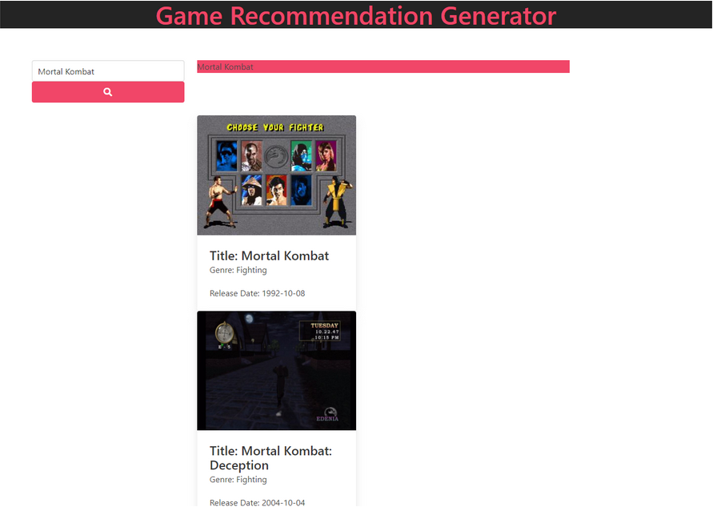

# Videogame Recommender: Group Project One

## Developed by:

- [Jordan Hackworth](https://github.com/HacAtac)

- [Marcus Osby](https://osbym.github.io/module2-challenge-portfolio/)

- [Eduardo Ramirez](https://github.com/EduardoRam7)

#### Deployed Application
https://osbym.github.io/videogame-recommender/

## Technologies Used
  1. Languages and Frameworks
    
  - HTML/CSS
    
  - Javascript/JQuery
    
  - AJAX
    
  - Bulma

  - Awesome Font

  
  2. APIs
  
  - RAWG
    
  - STEAM

## User Story:

As a video game enthusiast I'd like a game generator base off of search criteria.

## **Description:**
---
Our videogame recommender is a search engine that will help you find the next videogame to play. It's intended to help with the struggle of having too many options, and to avoid stress from having to pick the right game.

## **How to Use:**
---
Enter the game you just finished or played into the search bar. Clock on the shearch button. And a list of recommended games will be displayed.

## **Screenshot/GIF:**
---

When I decide which game I'd potentially like to play
Then I can save the game on webpage.

## Features:

- Mobile Responsive

- Instant access to populuar videogame titles

- All searches locally stored

